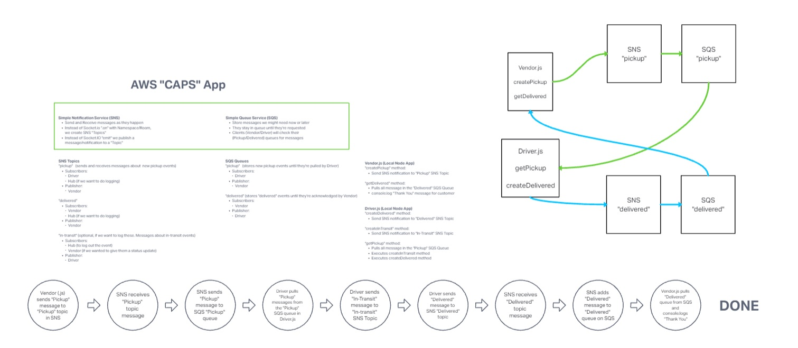

# caps-cloud
Lab 19 - AWS SNS/SQS CAPS

## Description
AWS SNS/SQS CAPS Server with js clients.

## Installation
npm install

## Usage
node index.js

## Dependencies
aws-sdk chance

## Whiteboard

## Requirements
SNS Topic (FIFO): pickup which will receive all pickup requests from vendors.
SQS Queue (FIFO): packages which will contain all delivery requests from vendors, in order of receipt.
Subscribe this queue to the pickup topic so all pickups are ordered.
SQS Queue (Standard) for each vendor (named for the vendor) which will contain all delivery notifications from the drivers.

vendor.js should be an SQS Subscriber
Connect it to the pickup topic by using it’s URL/ARN
Set it up to produce a new message to the “pickup” topic every few seconds, simulating an order
The order id and customer name can be randomized
Include the URL to the vendor’s personal delivery queue
Connect it to their own vendor queue by using it’s URL
As drivers deliver, this app will continually poll the queue, retrieve them, and log details out to the console
You should be able to disconnect this app, and see deliveries that happened while the app was not running
driver.js
Connect to the pickup queue and get only the next package
Wait a random number of seconds
Post a message to the Vendor’s “delivered” Queue (using the supplied URL in the order/message) to alert them of the delivery
Repeat until the queue is empty

